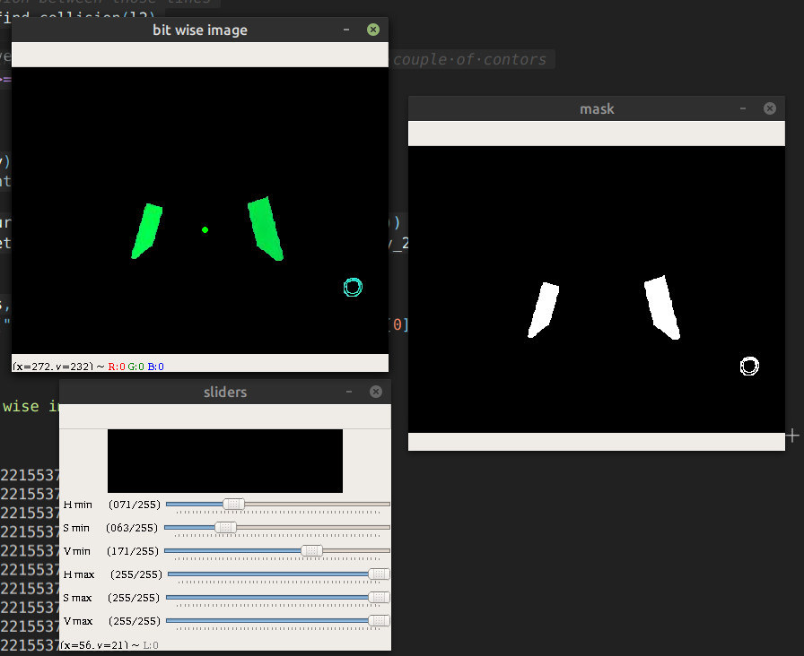
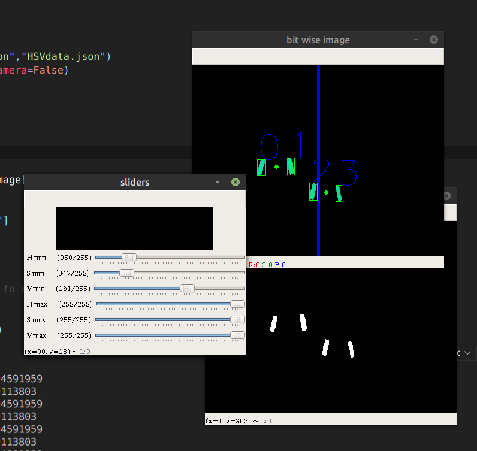
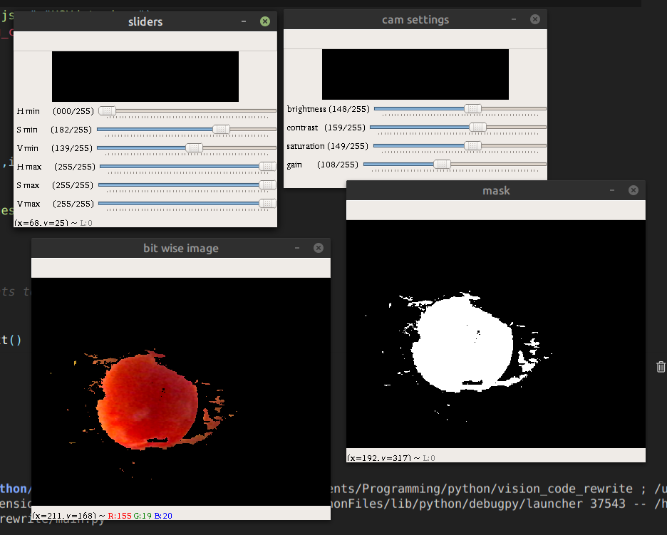

# Open Vision
**open vision** is an attempt to ease development of vision processing code during an FRC season.
this project is written in python and uses the ```open cv``` image processing library.  

as an example the code in the project solves the [FRC 2019 Deep Space](https://en.wikipedia.org/wiki/Destination:_Deep_Space) vision challange.



note that this project can do much more then that.


## Guide
this project requires you to have the [```open cv```](https://opencv.org) library for python
if you don't have it just use this following command:

```
pip install python-opencv
```

note that this project uses *opencv version 4.2.0 numpy version 1.16.6 and python version 3.6.9*
and that different version could cause unwanted errors

### Cool now how do I make this project my own?
that's easy!
first you need to understand how to project is structured.
``` app/processor.py ``` (yeah I know that's a bad name) handles the importent stuff, that being the *pipe line* 
of the project.
in the ```run``` method you can just write whatever opencv code you want and it will handle it perfectly

one more thing you should note when writing code is that the function expects you to return a *map* of stuff
I personaly put images, debug messages and the processing's results.
that map will be used for farther development. 
like streaming these images and slider on a local site
 
## TODO
even though this project is much better then the last one there is still much needed work to be done.

* add a deploy script that will copy the project to a raspberry pi and run it on startup
* add a script to change the wifi address to a static one at will
* add a web server that allows to debug and view the image from the robot's wifi

> this project started as rewrite of [this](https://github.com/chenPerach/vision2019), my first solution to the FRC 2019 vision processing challange, this was my first ever coding challange and I had fun doing it

